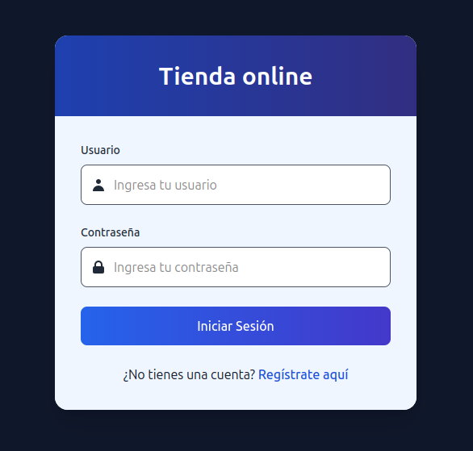
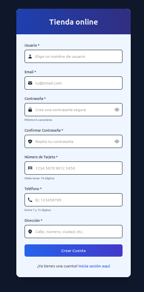
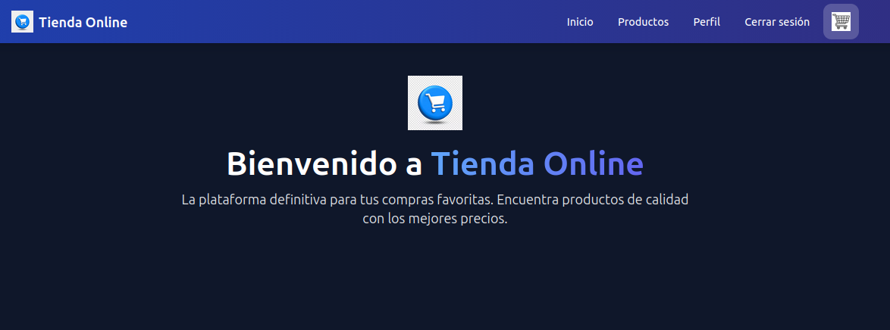
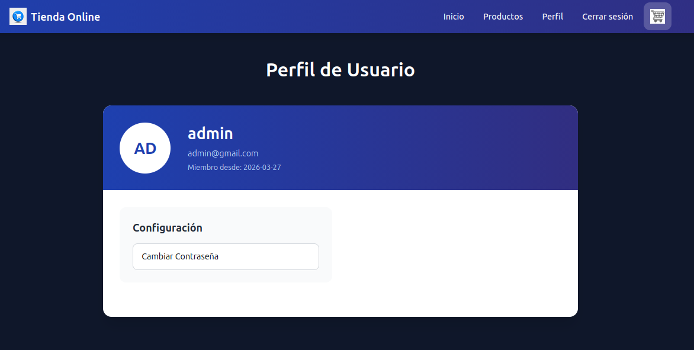
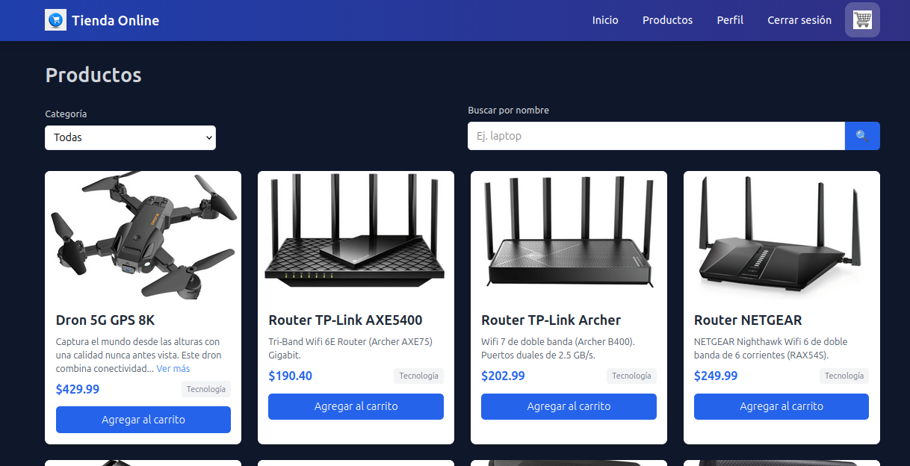
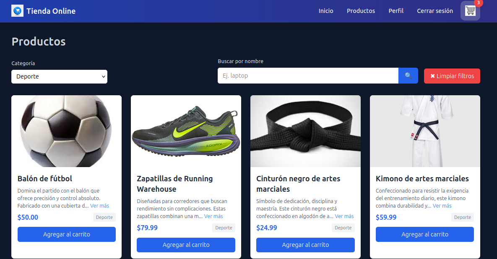
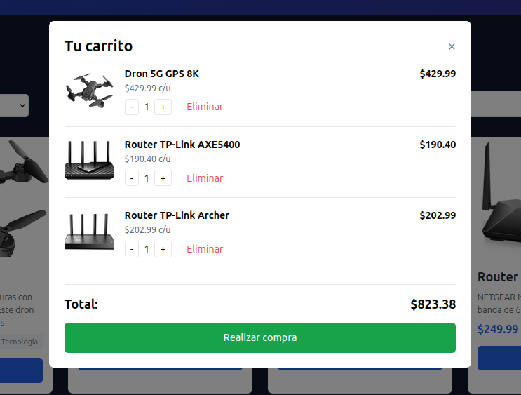
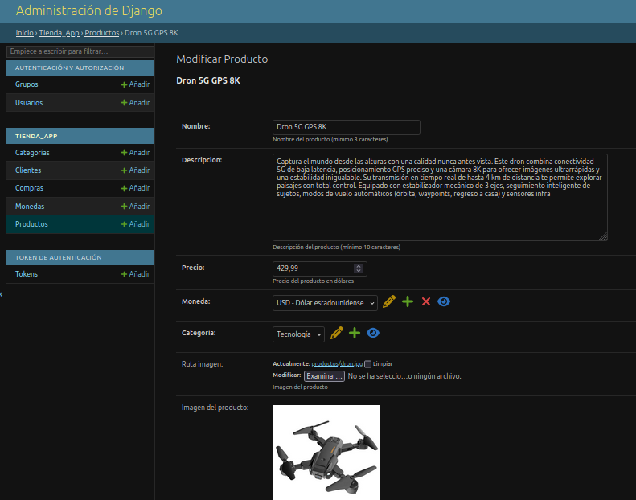
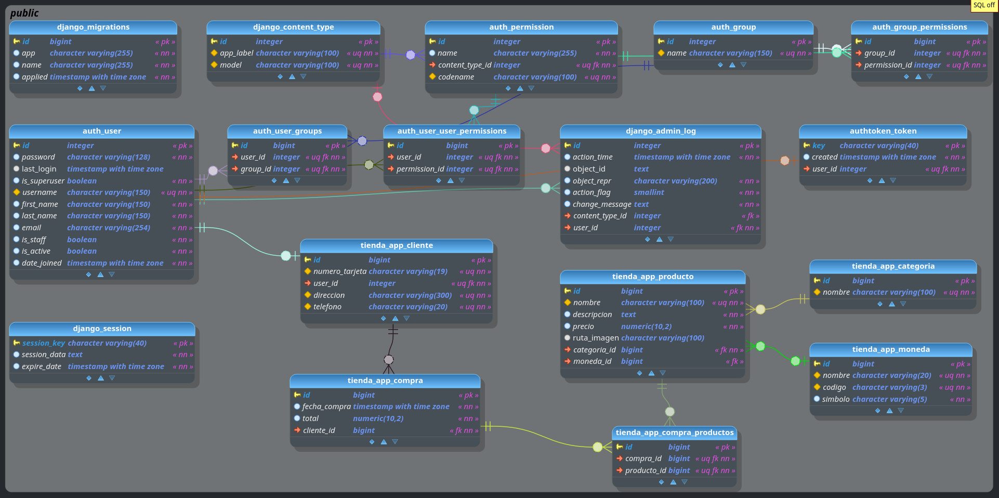

# 🛒 Tienda Online - Proyecto Full Stack

Plataforma de comercio electrónico desarrollada con **Django (DRF)** en el backend y **React + TypeScript** en el frontend. Permite registro de usuarios, gestión de productos, carrito de compras y procesamiento de pedidos.

## ✨ Características principales

- **Autenticación** con token (DRF TokenAuth)
- Registro de usuarios con:
  - Número de tarjeta (16 dígitos)
  - Teléfono (entre 7 y 15 dígitos)
  - Dirección
- Catálogo de productos con:
  - Paginación tipo “cargar más” (offset/limit)
  - Filtrado por categoría (desde el servidor)
  - Búsqueda por nombre
  - Vista previa de imagen
  - Descripción expandible
- Carrito de compras:
  - Agregar/eliminar productos
  - Ajustar cantidades
  - Modal centrado con resumen y total
  - Registro de compra en base de datos
- Panel de administración de Django personalizado:
  - Vista previa de imágenes en edición de productos
  - Filtros y búsquedas
- Diseño responsive con Tailwind CSS

## 🧰 Tecnologías utilizadas

### Backend
- **Django** 6.0.2
- **Django REST Framework** (DRF)
- **PostgreSQL** 
- **Token Authentication**
- **Pillow** (manejo de imágenes)

### Frontend
- **React** 18 + TypeScript
- **React Router DOM**
- **Axios**
- **Tailwind CSS** (vía CDN / PostCSS)
- Context API para el carrito (CartContext)

## 📁 Estructura del proyecto (simplificada)

```
TIENDA ONLINE/
├── frontend/               # Aplicación React + TypeScript
│   ├── img/                # Imágenes estáticas
│   └── media/              # Archivos subidos (imágenes de productos)
├── tienda_app/             # Aplicación principal de Django
│   ├── migrations/         # Migraciones de base de datos
│   ├── models/             # Modelos (Producto, Categoria, Moneda, etc.)
│   ├── serializers/        # Serializadores DRF
│   ├── admin.py            # Configuración del panel admin
│   ├── urls.py             # Rutas de la API
│   └── views.py            # Vistas de la API
├── tienda_online/          # Configuración del proyecto Django
│   ├── settings.py         # Configuración (base de datos, apps, etc.)
│   └── urls.py             # Rutas principales
├── .env                    # Variables de entorno (clave secreta, etc.)
├── .gitignore
├── build.sh                # Script de construcción (opcional)
├── manage.py               # Comando de administración de Django
├── readme.md               # Este archivo
└── requirements.txt        # Dependencias de Python
```


> Nota: Se omiten archivos como `__pycache__`, `__init__.py` y otros detalles internos para mayor claridad.

## 🚀 Instalación y ejecución

### Requisitos previos
- Python 3.10+
- Node.js 18+
- PostgreSQL (opcional, puedes usar SQLite)

### Backend (Django)

```bash
cd backend
python -m venv venv
source venv/bin/activate  # Linux/Mac
# o venv\Scripts\activate (Windows)

pip install -r requirements.txt
python manage.py migrate
python manage.py runserver


Frontend (React)

cd frontend
npm install
npm run dev


Variables de entorno

Crear un archivo .env en frontend/:


VITE_API_URL=http://localhost:8000/app


En Django, configurar settings.py con:

CORS_ALLOWED_ORIGINS = ['http://localhost:5173']
MEDIA_URL = '/media/'
MEDIA_ROOT = BASE_DIR / 'media'


📡 Endpoints principales
Método	Endpoint	             Descripción	                Autenticación
POST	/register/	          Registro de usuario	                  No
POST	/login/	          Inicio de sesión (devuelve token)	          No
POST	/logout/	             Cierre de sesión	                  Sí (token)
GET	/productos/	           Listado paginado de productos	          Sí
POST	/compras/	            Crear una compra	                  Sí


🖼️ Imágenes del proyecto

Login


Registro


Inicio


Perfil


Productos


Sección Deporte


Carrito


Panel de administración



## 📊 Modelo lógico de la base de datos

